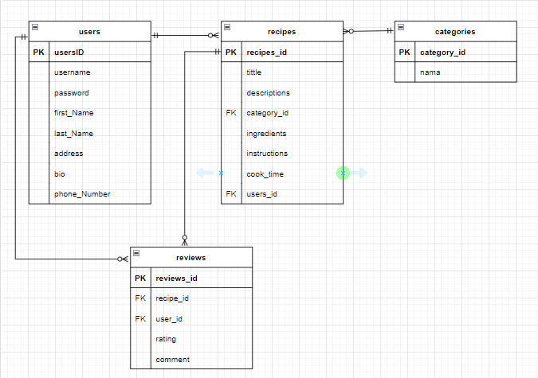

# Recipe Sharing

The recipe sharing application is a web server that provides services for users to share and search for food recipes. Users can create profiles, add recipes, search for recipes by category, provide ratings, and also make comments on existing recipes. Recipe sharing can be accessed via a website or mobile application to make it easier for users to access recipes anytime and anywhere.

## Tech Stack

This project is made by:

[](https://nodesource.com/products/nsolid) [](https://nodesource.com/products/nsolid) [](https://nodesource.com/products/nsolid) [](https://nodesource.com/products/nsolid) [](https://nodesource.com/products/nsolid) [](https://nodesource.com/products/nsolid)

## Architecture Diagram


## ERD



## Database

This project doesn't contain database migrations, so you need to create the database and the tables by yourself, here is the syntax:

Create database recipe sharing:

```
CREATE DATABASE recipe_db;
```

Create users table:

```
CREATE TABLE users
(
    usersID 	 INT (5)      NOT NULL auto_increment PRIMARY KEY,
    username     VARCHAR(50)  NOT NULL,
    password     VARCHAR(255) NOT NULL,
    first_Name    VARCHAR(20)  NOT NULL,
    last_Name     VARCHAR(20)  NOT NULL,
    address      VARCHAR(50)  NOT NULL,
    bio          VARCHAR(255),
    phone_Number Numeric(12)  NOT NULL
);
```

Create recipes table:

```
CREATE TABLE recipes (
    recipe_id INT (5) NOT NULL AUTO_INCREMENT,
    title VARCHAR(100) NOT NULL,
    descriptions VARCHAR(300),
    category_id INT NOT NULL,
    ingredients  TEXT NOT NULL,
    instructions TEXT NOT NULL,
    cook_time TIME,
    user_id INT NOT NULL,
    PRIMARY KEY (recipe_id),
    FOREIGN KEY (user_id) REFERENCES users (usersID),
    FOREIGN KEY (category_id) REFERENCES categories (category_id)
);
```
Create categories table:

```
CREATE TABLE categories (
    category_id INT (5) NOT NULL AUTO_INCREMENT,
    nama VARCHAR(50) NOT NULL,
    PRIMARY KEY (category_id)
);
```
Create reviews table:

```
CREATE TABLE reviews (
  review_id INT NOT NULL AUTO_INCREMENT,
  recipe_id INT NOT NULL,
  user_id INT NOT NULL,
  rating INT NOT NULL CHECK (rating BETWEEN 1 AND 5), -- rating antara 1-5
  comment TEXT,
  PRIMARY KEY (review_id),
  FOREIGN KEY (recipe_id) REFERENCES recipes(recipe_id) ON DELETE CASCADE,
  FOREIGN KEY (user_id) REFERENCES users(usersID) ON DELETE CASCADE
);
```
## How To Run It Locally

Clone the project:

```
git clone https://github.com/alvianistiqlalhanafi/recipe_sharing.git
```

Go to the project directory:

```
cd recipe-sharing-project
```

Install dependencies:

```
npm install
```

Start the server:

```
npm run start
```

## Environment Variables

To run this project, you need to setup the following environment variables to your .env file:

```
PORT=5000
DB_HOST= localhost
DB_USER = root
DB_PASSWORD = #your_db_password
DB_NAME = #your_db_username
```

## API Endpoint

Users API Endpoint :

```
| Method | Endpoint         | Description                         |
| ------ | ---------------- | ----------------------------------- |
| GET    | /users           | Get the list all users              |
| GET    | /users/{usersID} | Get users by usersID                |
| POST   | /users           | Create new users                    |
| PUT    | /users/{usersID} | Update spesific users               |
| DELETE | /users/{usersID} | Delete spesific users               |
```
Recipes API Endpoint :

```
| Method | Endpoint         | Description                         |
| ------ | ---------------- | ----------------------------------- |
| GET    | /recipes         | Get the list all recipes            |
| GET    | /recipes/{id}    | Get recipes by recipe_id            |
| POST   | /recipes         | Create new recipes                  |
| PUT    | /recipes/{id}    | Update spesific recipes             |
| DELETE | /recipes/{id}    | Delete spesific recipes             |
```
Categories API Endpoint :

```
| Method | Endpoint         | Description                         |
| ------ | ---------------- | ----------------------------------- |
| GET    | /categories      | Get the list all categories         |
| GET    | /categories/{id} | Get categories by categories_id     |
| POST   | /categories      | Create new categories               |
| PUT    | /categories/{id} | Update spesific categories          |
| DELETE | /categories/{id} | Delete spesific categories          |
```
Reviews API Endpoint :

```
| Method | Endpoint         | Description                         |
| ------ | ---------------- | ----------------------------------- |
| POST   | /reviews         | Create new reviews                  |
| DELETE | /reviews/{id}    | Delete spesific reviews             |
```